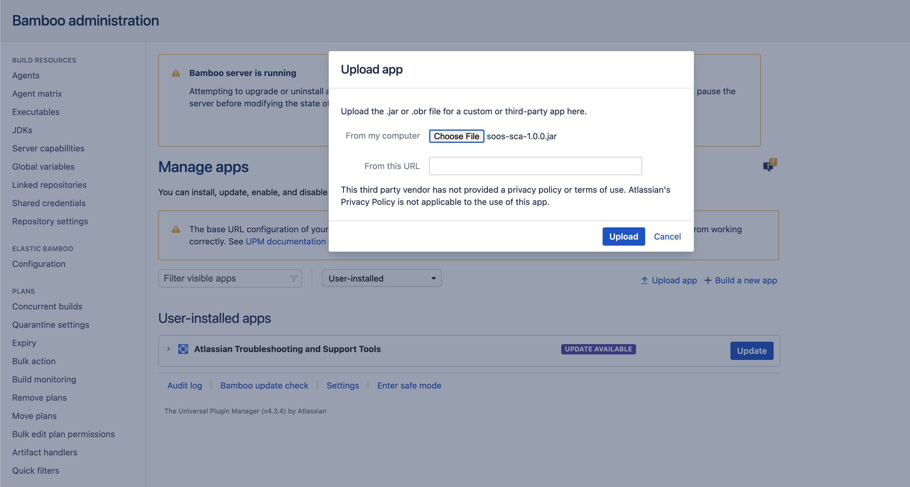
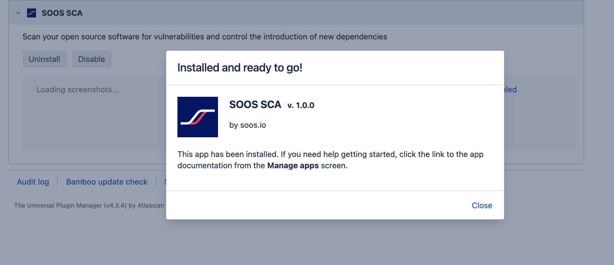
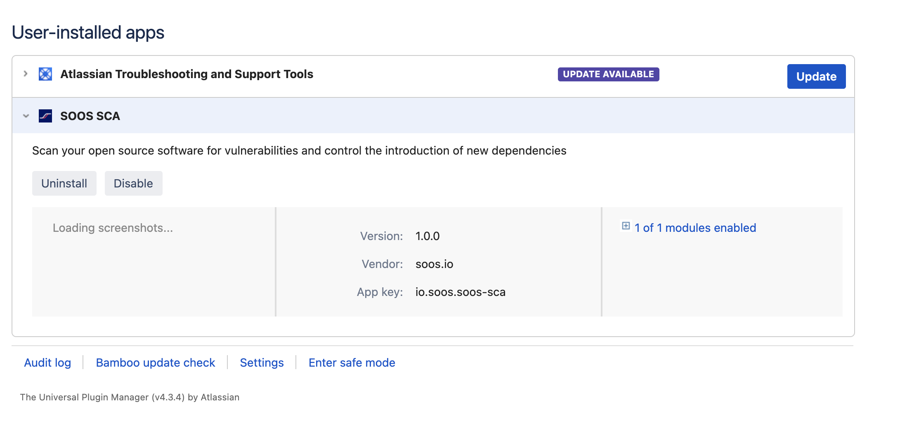

# [SOOS Core SCA for Bamboo](https://soos.io/sca-product)

SOOS is an independent software security company, located in Winooski, VT USA, building security software for your team. [SOOS, Software security, simplified](https://soos.io).

Use SOOS to scan your software for [vulnerabilities](https://app.soos.io/research/vulnerabilities) and [open source license](https://app.soos.io/research/licenses) issues with [SOOS Core SCA](https://soos.io/sca-product). [Generate SBOMs](https://kb.soos.io/help/soos-reports-for-export). Govern your open source dependencies. Run the [SOOS DAST vulnerability scanner](https://soos.io/dast-product) against your web apps or APIs.

[Demo SOOS](https://app.soos.io/demo) or [Register for a Free Trial](https://app.soos.io/register).

If you maintain an Open Source project, sign up for the Free as in Beer [SOOS Community Edition](https://soos.io/products/community-edition).

## How to Use

The **SOOS SCA Plugin** will locate and analyze any supported manifest files under the specified directory.

To use SOOS SCA Plugin you need to:

1. [Install the SOOS SCA Plugin](#install-the-soos-sca-plugin)
2. [Configure authorization](#configure-authorization)
3. [Select the mode](#select-the-mode)
4. [Configure other plugin parameters](#configure-other-plugin-parameters)

## Supported Languages and Package Managers

*	[Node (NPM)](https://www.npmjs.com/)
*	[Python (pypi)](https://pypi.org/)
*	[.NET (NuGet)](https://www.nuget.org/)
*	[Ruby (Ruby Gems)](https://rubygems.org/)
*	[Java (Maven)](https://maven.apache.org/)

Our full list of supported manifest formats can be found [here](https://kb.soos.io/help/soos-languages-supported).

## Need an Account?
**Visit [soos.io](https://app.soos.io/register) to create your trial account.**

## Setup

### Install the SOOS SCA Plugin

Install or upgrade the SOOS SCA Plugin from Atlassian Marketplace with these steps. Once complete, you’re all set to add a SOOS SCA task to your projects.

Log in to your Bamboo instance to install the SOOS SCA Plugin. Navigate to **administration (gear icon)>Manage Apps** and click on the link **Find new apps**, search for **SOOS SCA** and from the Get dropdown list, select to install the plugin for your Bamboo installation. When the installation ends, a prompt appears, notifying the plugin has been installed. Ensure the plugin is enabled.

To manually install the plugin you have two options:

1.  Shut down Bamboo server. Copy the plugin .jar file into <bamboo-home-folder>/plugins/. Start-up Bamboo server again.
2.  Download the .jar file, log in to your Bamboo instance, navigate to **administration (gear icon)>Manage Apps**, and click the "Upload app" button, choose the **soos-sca.jar** file, and click upload button to install the plugin for your Bamboo installation. When the installation ends, a prompt appears, notifying the plugin has been installed. Ensure the plugin is enabled.

<blockquote style="margin-bottom: 10px;">

 Show example 

</blockquote>

### Configure authorization

**SOOS SCA Plugin** needs environment variables which are passed as parameters. These environment variables are stored by checking "Global variables" on administration (gear icon), and they are required for the task to operate.

| Property | Description |
| --- | --- |
| SOOS_CLIENT_ID | Provided to you when subscribing to SOOS services. |
| SOOS_API_KEY | Provided to you when subscribing to SOOS services. |

These values can be found in the SOOS App under Integrate.

### Select the mode

#### Run and wait for the analysis report
Set the **Mode** parameter to *Run and wait*, then you can run the plans in your CI/CD, and wait for the scan to complete.

#### Start the Scan
Set the **Mode** parameter to *Async init*, if you don't care about the scan result in your CI/CD plan, this is all you have to do!

#### Wait for the Scan
If you care about the result or want to break the build when issues occur, set the **Mode** parameter to *Async result*.
### Configure other plugin parameters

<blockquote style="margin-bottom: 10px;">

 Show parameters 

| Select/Inputs | Default | Description |
| --- | --- | --- |
| Project Name | ""  | REQUIRED. A custom project name that will present itself as a collection of test results within your soos.io dashboard. |
| Branch Name | ""  | The name of the branch from the SCM System |
| Branch URI | ""  | The URI to the branch from the SCM System |
| Commit Hash | ""  | The commit hash value from the SCM System |
| Build URI | ""  | URI to CI build info |
| Mode | "Run and wait"  | Running mode, alternatives: "Async init" - "Async result" |
| Directories To Exclude | ""  | List (comma separated) of directories (relative to ./) to exclude from the search for manifest files. Example - Correct: bin/start/ ... Example - Incorrect: ./bin/start/ ... Example - Incorrect: /bin/start/'|
| Files To Exclude | ""  | List (comma separated) of files (relative to ./) to exclude from the search for manifest files. Example - Correct: bin/start/manifest.txt ... Example - Incorrect: ./bin/start/manifest.txt ... Example - Incorrect: /bin/start/manifest.txt' |
| On Failure | "Fail the build"  | Stop the building in case of failure, alternative: "Continue on failure" |
| Analysis Res. Max Wait | 300  | Maximum seconds to wait for Analysis Result before exiting with error. |
| Analysis Res. Polling Interval | 10  | Polling interval (in seconds) for analysis result completion (success/failure.). Min 10. |
| API Base URL | "https://api.soos.io/api/"  | The API BASE URI provided to you when subscribing to SOOS services. |

</blockquote>

## Feedback and Support
### Knowledge Base
[Go To Knowledge Base](https://kb.soos.io/help)

